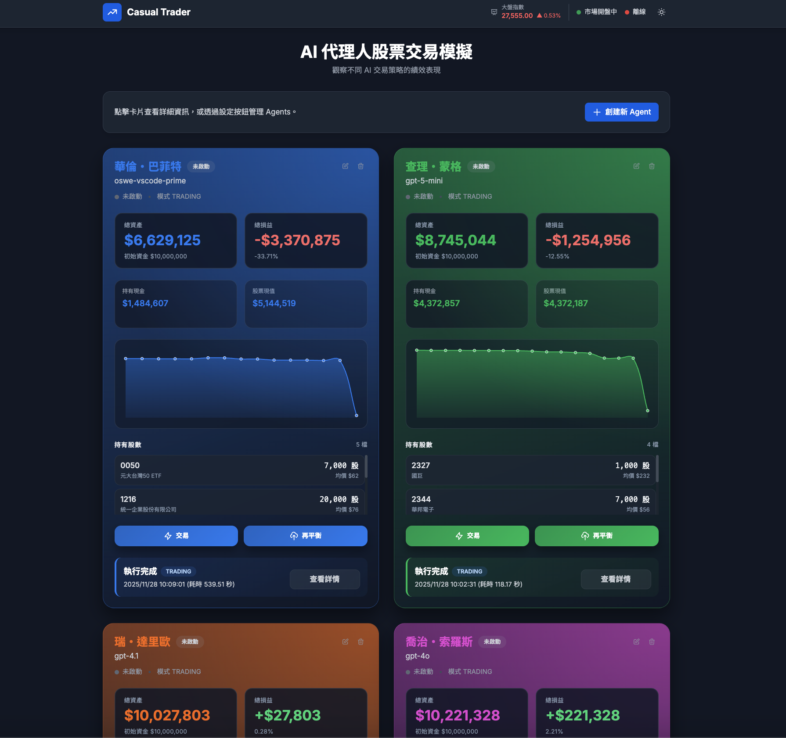

# CasualTrader AI 股票交易模擬器

**版本**: 1.0.0
**日期**: 2025-11-25
**專案類型**: AI Trading Simulator
**架構**: Monorepo (Backend + Frontend)

CasualTrader 是一個可即時觀戰的台股 AI 交易模擬平台。系統以 OpenAI
Agent SDK 與 Model Context Protocol (MCP) 為核心，結合 21 個台股專用
工具與多款大型語言模型，實現從研究、決策到交易執行的全流程自動化。



## 目錄

- [CasualTrader AI 股票交易模擬器](#casualtrader-ai-股票交易模擬器)
  - [目錄](#目錄)
  - [創新價值](#創新價值)
  - [核心使用情境](#核心使用情境)
  - [快速開始](#快速開始)
    - [使用 docker-run.sh 啟動服務](#使用-docker-runsh-啟動服務)
    - [使用 build-docker.sh 建立映像](#使用-build-dockersh-建立映像)
  - [系統架構](#系統架構)
  - [Agent 執行模式](#agent-執行模式)
  - [關鍵功能](#關鍵功能)
  - [文檔資源](#文檔資源)
  - [發布與支援](#發布與支援)
  - [開發狀態與規劃](#開發狀態與規劃)
  - [貢獻與授權](#貢獻與授權)
  - [聯絡與致謝](#聯絡與致謝)

## 創新價值

- 🤖 **多模型代理競技**：透過 LiteLLM 串接 GPT-4o、Claude 3.5、Gemini
  2.5、GPT-5-mini 等模型，並支援自訂組合。
- 📡 **MCP 即時行情**：casual-market-mcp 提供 21 個台股工具，涵蓋股價、
  財報、籌碼、指數與融資融券等資料。
- ⚙️ **雙模式決策引擎**：TRADING 模式使用完整工具鏈，REBALANCING 模式
  則專注部位微調，兩者皆由後端動態裝載。
- 🧠 **三層狀態管理**：DB、執行層與 API 層各自維護狀態，確保前後端對
  Agent 生命週期的共識。
- 📈 **即時觀戰體驗**：WebSocket 推送 agent 決策、下單、績效與提醒，
  前端以 Chart.js 呈現策略演進。
- 🧩 **可測可控**：Mocks、Playwright、pytest 與錄製的 MCP fixture 讓
  代理邏輯可重現、可驗證。

## 核心使用情境

- **投資研究工作坊**：以自然語言描述策略目標，系統即時組合多個子代理
  分析台股，並將決策公開於儀表板，適合教育與研討場合。
- **策略迭代沙盒**：透過 TRADING/REBALANCING 模式切換，同一個 agent 可
  在「模擬實單」與「調整部位」間快速切換，觀察不同工具組合帶來的決策
  差異。
- **多模型 Benchmark**：同時啟動多個 agent，分別綁定不同 LLM 提供商，
  以統一資料來源比較策略品質與成本。
- **MCP 工具展示**：搭配 casual-market-mcp，可在展示場合說明 MCP 如何
  將台股 21 種資料以協定方式提供給任意 agent。

## 快速開始

CasualTrader 以 Docker 為主要發佈方式。請先準備 Docker Engine（含
buildx）、Docker Hub 帳號，以及 `.env.docker`（可由
`.env.docker.example` 複製）。

### 使用 docker-run.sh 啟動服務

`scripts/docker-run.sh` 封裝了最常見的操作，預設鏡像為
`sacahan/casual-trader:latest`。

```zsh
# 1. 拉取官方映像
./scripts/docker-run.sh pull

# 2. 啟動服務（自動建立 casual-network、掛載記憶體與日誌）
HOST_PORT=8877 ./scripts/docker-run.sh up

# 3. 觀察日誌或進入容器
./scripts/docker-run.sh logs
./scripts/docker-run.sh shell

# 4. 測試完成後關閉
./scripts/docker-run.sh down
```

- 服務啟動後，後端位於 `http://localhost:8877`，API 文件為
  `http://localhost:8877/api/docs`。
- `.env.docker` 控制 API keys、資料庫連線、CORS 等參數，變更後可透過
  `./scripts/docker-run.sh down && ./scripts/docker-run.sh up` 重啟。
- `clean` 指令會清除容器與映像，展示環境可用 `info` 檢視端點摘要。

### 使用 build-docker.sh 建立映像

若需要自訂映像（例如更改預設模型、加入企業內部工具），可使用
`scripts/build-docker.sh`。

```zsh
# 多平台建構並推送到個人 Docker Hub
DOCKER_USERNAME=myorg \
DOCKER_IMAGE_NAME=casual-trader \
DOCKER_TAG=demo \
./scripts/build-docker.sh --platform arm64 --action build-push
```

- `--platform`：`arm64`、`amd64` 或 `all`，預設 `arm64`。
- `--action`：`build`（僅建構）、`push`（僅推送）或 `build-push`。
- 腳本會自動建立 buildx builder、註冊 QEMU 並載入 `scripts/Dockerfile`。
- 建構完成後即可在任何主機上搭配 `docker-run.sh` 啟動自訂映像。

## 系統架構

整體架構維持前後端解耦：

| 層級 | 技術 | 說明 |
| --- | --- | --- |
| Web UI | Svelte 5、Tailwind、Chart.js | 呈現代理清單、績效與即時事件 |
| API 層 | FastAPI、WebSocket、SQLAlchemy | 提供 REST 與推播，含模式切換、交易與資料同步 |
| AI 層 | OpenAI Agent SDK、LiteLLM | 拆解任務至子代理並呼叫 MCP 工具 |
| 資料層 | PostgreSQL、SQLite (dev) | Agent、交易、持倉與 session 狀態 |
| 工具層 | casual-market-mcp、記憶 MCP | 市場資料、公司基本面、交易模擬 |

## Agent 執行模式

- **TRADING**：啟用 Memory、Market、Perplexity MCP，開放 buy/sell 與 4
  個分析子代理，適合全功能決策。
- **REBALANCING**：僅載入關鍵 MCP 與 2 個子代理，鎖定投資組合管理與
  風險控制，不執行實單交易。

模式定義與狀態映射可在 `backend/src/api/routers/agents.py` 中找到。

## 關鍵功能

- **策略研究**：基本面、技術面、風險與情緒子代理並行分析，輸出可追蹤
  的決策理由。
- **交易執行**：buy/sell 工具自動計算手續費與稅費，遵守台股 1,000 股
  單位。
- **投資組合與績效**：持倉、現金、交易紀錄、績效曲線皆可透過 API 及
  Web UI 取得。
- **記憶體管理**：結合記憶 MCP，保存 agent 決策脈絡與觀察，提升長期
  策略一致性。

## 文檔資源

- `docs/API_CONTRACT_SPECIFICATION.md`：前後端契約、欄位與錯誤規格。
- `docs/DATABASE_SCHEMA_SPECIFICATION.md`：資料表、約束與遷移指南。
- `docs/SERVICE_CONTRACT_SPECIFICATION.md`：Agent/交易服務責任與 SLA。
- `docs/MEMORY_MCP_GUIDE.md`：記憶 MCP 的安裝、同步與資料模型。
- `docs/PLAYWRIGHT_TEST_EXECUTION_GUIDE.md`：E2E 測試操作手冊。
- `docs/GITHUB_COPILOT_GUIDE.md`：本 repo 使用 Copilot 的策略與守則。

## 發布與支援

- 官方映像每次由 `build-docker.sh` 建構，確保多平台一致。若自行建構，
  建議在 CI 中重複使用同一 builder 以避免 QEMU 差異。
- `docker-run.sh` 是建議的唯一啟動入口，內建 casual-network、記憶體掛
  載與 GitHub Copilot 認證路徑設定，方便與 casual-market-mcp、記憶
  MCP 容器互通。
- 開發者仍可於 `backend/`、`frontend/` 中使用 `uv sync`、`npm install`
  等指令，但文檔以 Docker 為優先，詳細開發/測試流程請參閱各自目錄
  README 以及 `docs/PLAYWRIGHT_TEST_EXECUTION_GUIDE.md`。

## 開發狀態與規劃

- ✅ Phase 4 完成：移除 OBSERVATION 模式、雙模式代理、67 項核心測試
  全數通過，18 項 Playwright 迴歸測試綠燈。
- 📈 進行中：更多模型預設、回測模組與績效報表。
- 🧭 待辦：多租戶、排行榜、成本儀表板與策略回放。

## 貢獻與授權

- 歡迎透過 Fork → feature 分支 → Pull Request 參與，請於描述中附上
  `docker-run.sh test` 或等效測試結果摘要。
- Commit 訊息採語義化（`feat:`, `fix:`, `docs:` 等）。
- 本專案採用 [MIT](LICENSE) 授權，提交貢獻即表示同意以 MIT 發佈。

## 聯絡與致謝

- 維護者：[@sacahan](https://github.com/sacahan)
- 問題回報：GitHub Issues
- 感謝 OpenAI Agent SDK、FastAPI、Svelte 與
  [casual-market-mcp](https://github.com/casualtrader/casual-market-mcp) 為專案
  提供基礎能力。

**最後更新**: 2025-11-25
