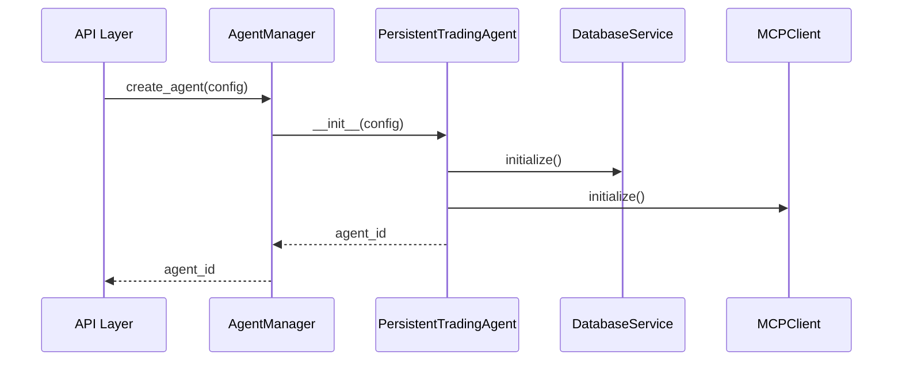
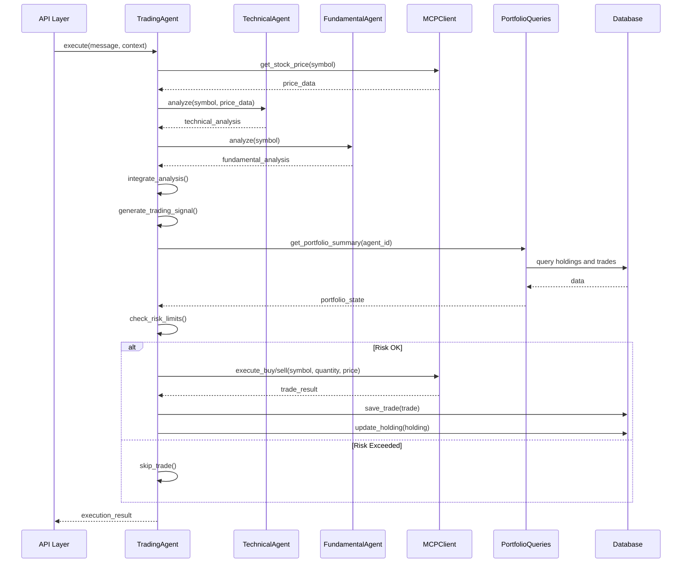
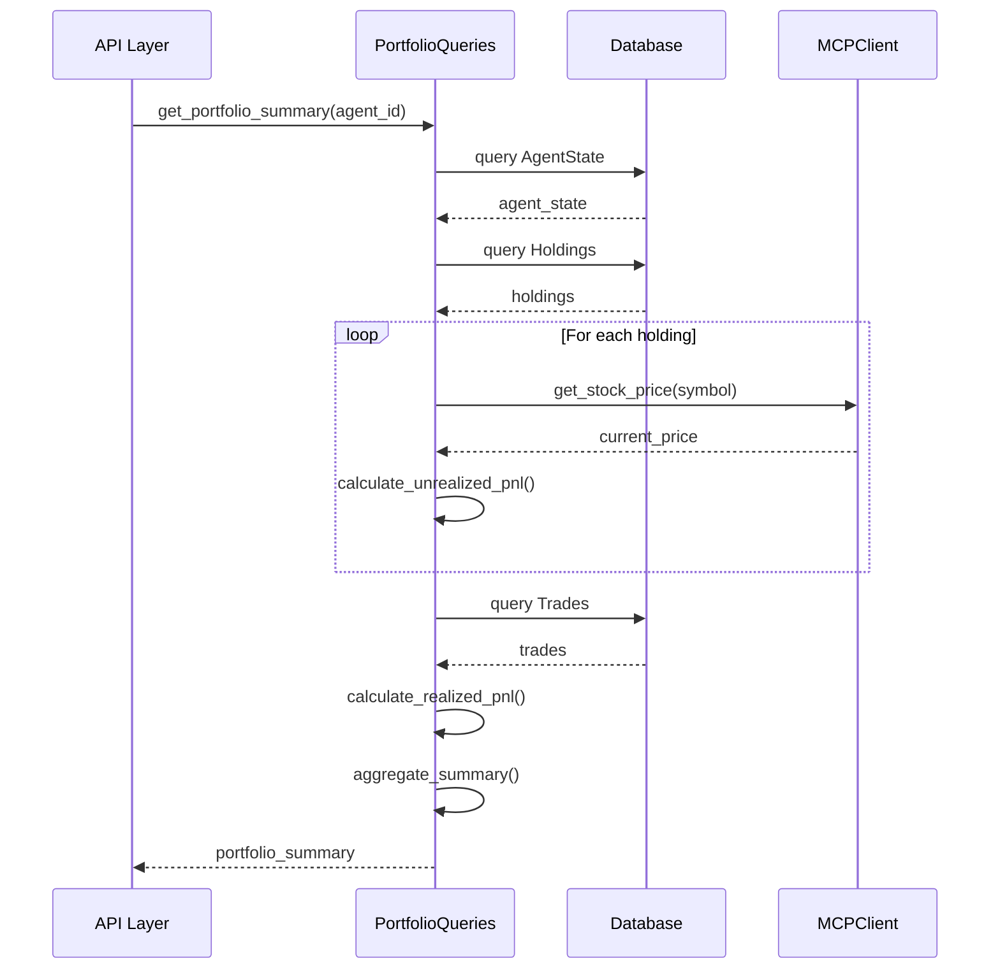
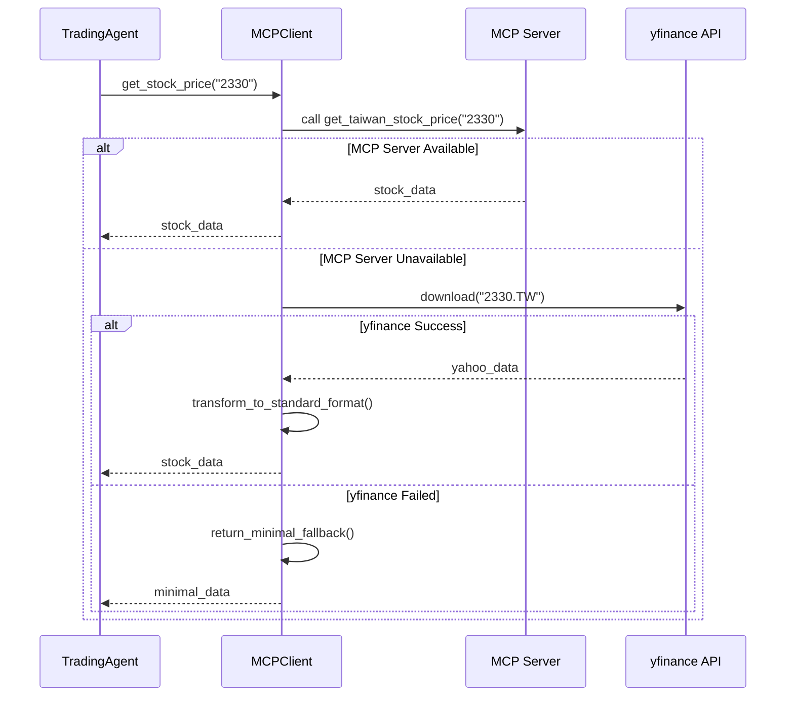

# CasualTrader Agents 模組架構說明

## 目錄

1. [總覽](#總覽)
2. [模組結構](#模組結構)
3. [核心層 (core/)](#核心層-core)
4. [功能層 (functions/)](#功能層-functions)
5. [整合層 (integrations/)](#整合層-integrations)
6. [工具層 (tools/)](#工具層-tools)
7. [交易層 (trading/)](#交易層-trading)
8. [工具層 (utils/)](#工具層-utils)
9. [模組依賴關係](#模組依賴關係)
10. [互動流程](#互動流程)
11. [資料流向](#資料流向)

---

## 總覽

`src/agents/` 目錄是 CasualTrader 的核心智能交易系統，採用分層架構設計，實現了基於 OpenAI Agent SDK 的自主交易決策系統。

### 設計理念

- **分層架構**: 清晰的職責分離，從核心抽象到具體實現
- **可擴展性**: 通過工具和功能模組輕鬆添加新能力
- **資料持久化**: 整合資料庫服務確保狀態一致性
- **異步設計**: 全面使用 async/await 提升性能

### 技術棧

- **Python 3.12+**: 使用最新語法特性 (type hints, match 語句等)
- **OpenAI Agent SDK**: 智能 Agent 框架
- **SQLAlchemy Async**: 異步 ORM
- **yfinance**: 市場數據來源
- **MCP Tools**: Model Context Protocol 工具集成

---

## 模組結構

```
src/agents/
├── __init__.py
├── core/                    # 核心層 - Agent 基礎架構
│   ├── base_agent.py       # Agent 抽象基類
│   ├── agent_manager.py    # Agent 生命週期管理
│   ├── agent_session.py    # Agent 會話管理
│   ├── models.py           # 核心數據模型
│   ├── instruction_generator.py  # 動態指令生成
│   ├── strategy_tracker.py      # 策略追蹤
│   └── strategy_auto_adjuster.py # 策略自動調整
│
├── functions/              # 功能層 - 業務邏輯函數
│   ├── portfolio_queries.py     # 投資組合查詢
│   ├── market_status.py         # 市場狀態檢查
│   ├── trading_validation.py   # 交易驗證
│   └── strategy_change_recorder.py # 策略變更記錄
│
├── integrations/           # 整合層 - 外部服務整合
│   ├── mcp_client.py       # MCP 工具客戶端
│   ├── database_service.py # 資料庫服務
│   ├── persistent_agent.py # 持久化 Agent
│   └── openai_tools.py     # OpenAI 工具定義
│
├── tools/                  # 工具層 - 自主型分析 Agent
│   ├── technical_agent.py  # 技術分析 Agent
│   ├── fundamental_agent.py # 基本面分析 Agent
│   ├── sentiment_agent.py   # 情緒分析 Agent
│   └── risk_agent.py        # 風險分析 Agent
│
├── trading/                # 交易層 - 交易決策執行
│   └── trading_agent.py    # 主要交易 Agent
│
└── utils/                  # 工具層 - 共用工具函數
    ├── logger.py           # 日誌工具
    ├── risk_analytics.py   # 風險計算
    └── technical_indicators.py # 技術指標計算
```

---

## 核心層 (core/)

### 職責

提供 Agent 系統的基礎架構，定義 Agent 生命週期、狀態管理和執行框架。

### 關鍵組件

#### 1. `base_agent.py` - Agent 抽象基類

**功能**:

- 定義 Agent 的抽象接口和基本行為
- 管理 Agent 狀態轉換 (IDLE → RUNNING → COMPLETED/FAILED)
- 提供工具設置和執行上下文管理
- 集成 OpenAI Agent SDK

**核心類別**:

```python
class CasualTradingAgent(ABC):
    """Agent 抽象基類"""

    # 生命週期方法
    async def initialize() -> None
    async def cleanup() -> None

    # 抽象方法（子類必須實現）
    @abstractmethod
    async def _setup_tools() -> list[Any]

    @abstractmethod
    async def _generate_instructions(context: AgentExecutionContext) -> str

    # 執行方法
    async def execute(message: str, context: AgentExecutionContext) -> AgentExecutionResult
```

**依賴**:

- `models.py`: 使用核心數據模型
- OpenAI Agent SDK: 底層 Agent 框架

---

#### 2. `agent_manager.py` - Agent 生命週期管理

**功能**:

- 管理多個 Agent 實例的創建、啟動和停止
- 控制並發執行數量（信號量機制）
- 追蹤執行歷史和狀態
- 提供統一的 Agent 註冊和查詢接口

**核心類別**:

```python
class AgentManager:
    """Agent 管理器"""

    # Agent 管理
    async def create_agent(config: AgentConfig) -> str
    async def get_agent(agent_id: str) -> CasualTradingAgent
    async def remove_agent(agent_id: str) -> bool

    # 執行管理
    async def execute_agent(agent_id: str, message: str, context: AgentExecutionContext) -> AgentExecutionResult
    async def cancel_execution(agent_id: str) -> bool

    # 批量操作
    async def execute_all_agents(message: str) -> dict[str, AgentExecutionResult]
    async def cleanup_all() -> None
```

**依賴**:

- `base_agent.py`: 管理 CasualTradingAgent 實例
- `models.py`: 使用 AgentConfig, AgentState
- asyncio: 異步並發控制

**管理策略**:

- **並發限制**: 使用 Semaphore 控制最大並發執行數（默認 10）
- **資源清理**: 自動追蹤和清理已完成的執行任務
- **故障恢復**: 隔離 Agent 故障，不影響其他 Agent

---

#### 3. `agent_session.py` - Agent 會話管理

**功能**:

- 管理 Agent 與用戶的交互會話
- 追蹤會話狀態和歷史消息
- 提供會話持久化和恢復
- 支持多輪對話上下文

**核心類別**:

```python
class AgentSession:
    """Agent 會話管理"""

    # 會話生命週期
    async def start_session(agent_id: str) -> str
    async def end_session(session_id: str) -> None
    async def resume_session(session_id: str) -> bool

    # 消息管理
    async def add_message(role: str, content: str) -> None
    async def get_history() -> list[dict]

    # 狀態追蹤
    def get_session_status() -> SessionStatus
    def get_turn_count() -> int
```

**依賴**:

- `models.py`: SessionStatus, AgentState
- `database_service.py`: 會話持久化

---

#### 4. `models.py` - 核心數據模型

**功能**:

- 定義系統所有核心數據結構
- 提供類型安全的數據驗證（Pydantic）
- 統一數據模型規範

**核心模型**:

```python
# Agent 配置
class AgentConfig(BaseModel):
    name: str
    mode: AgentMode
    model: str = "gpt-4o-mini"
    max_turns: int = 30
    enabled_tools: dict[str, bool]
    risk_limits: dict[str, float]

# Agent 狀態
class AgentState(BaseModel):
    agent_id: str
    status: AgentStatus
    current_session_id: str | None
    portfolio_value: float
    cash_balance: float
    created_at: datetime
    updated_at: datetime

# 執行上下文
class AgentExecutionContext(BaseModel):
    agent_id: str
    session_id: str
    mode: AgentMode
    market_conditions: dict[str, Any]
    portfolio_state: dict[str, Any]

# 執行結果
class AgentExecutionResult(BaseModel):
    agent_id: str
    session_id: str
    success: bool
    message: str
    actions_taken: list[dict[str, Any]]
    execution_time: float
    timestamp: datetime
```

**枚舉類型**:

- `AgentMode`: CONSERVATIVE, BALANCED, AGGRESSIVE
- `AgentStatus`: IDLE, RUNNING, PAUSED, STOPPED, ERROR
- `SessionStatus`: ACTIVE, COMPLETED, FAILED

---

#### 5. `instruction_generator.py` - 動態指令生成

**功能**:

- 根據市場狀況和 Agent 模式動態生成指令
- 自適應策略調整
- 風險控制參數動態調整

**核心方法**:

```python
async def generate_trading_instructions(
    context: AgentExecutionContext,
    market_data: dict[str, Any],
    portfolio_state: dict[str, Any]
) -> str:
    """生成動態交易指令"""
```

---

#### 6. `strategy_tracker.py` - 策略追蹤

**功能**:

- 追蹤策略變更歷史
- 分析策略效果
- 提供策略回溯能力

---

#### 7. `strategy_auto_adjuster.py` - 策略自動調整

**功能**:

- 基於績效自動調整策略參數
- 動態風險管理
- 市場適應性優化

---

## 功能層 (functions/)

### 職責

實現具體業務邏輯功能，提供可重用的業務函數，被 Agent 和 API 層調用。

### 關鍵組件

#### 1. `portfolio_queries.py` - 投資組合查詢

**功能**:

- 查詢投資組合摘要（持倉、現金、市值）
- 計算未實現/已實現損益
- 獲取交易歷史
- 計算績效指標（回報率、夏普比率等）

**核心類別**:

```python
class PortfolioQueries:
    """投資組合查詢功能"""

    def __init__(self, db_session: AsyncSession, mcp_client=None)

    # 查詢方法
    async def get_portfolio_summary(agent_id: str) -> dict[str, Any]
    async def get_trade_history(agent_id: str, limit: int = 50) -> list[dict]
    async def get_performance_metrics(agent_id: str) -> dict[str, Any]

    # 內部方法
    async def _get_positions_data(agent_id: str) -> list[dict]
    async def _get_cash_balance(agent_id: str) -> float
    async def _get_realized_pnl(agent_id: str) -> float
```

**數據來源**:

- 資料庫: Trade, Holding, AgentState 表
- MCP Client: 即時股價數據

**依賴**:

- `database.models`: AgentState, Trade, Holding
- `mcp_client`: 獲取即時價格
- SQLAlchemy AsyncSession

**重要更新**:
✅ 已移除所有模擬數據，完全使用真實資料庫查詢

---

#### 2. `market_status.py` - 市場狀態檢查

**功能**:

- 檢查交易日（台灣股市）
- 檢查交易時間段
- 獲取市場休市狀態

**核心方法**:

```python
async def is_trading_day(date: datetime) -> bool
async def is_trading_hours() -> bool
async def get_market_status() -> dict[str, Any]
```

---

#### 3. `trading_validation.py` - 交易驗證

**功能**:

- 驗證交易參數合法性
- 檢查風險限制
- 驗證資金充足性

**核心方法**:

```python
async def validate_trade_request(
    agent_id: str,
    symbol: str,
    action: str,
    quantity: int,
    price: float | None
) -> ValidationResult
```

---

#### 4. `strategy_change_recorder.py` - 策略變更記錄

**功能**:

- 記錄策略變更事件
- 分析變更原因
- 生成變更報告

---

## 整合層 (integrations/)

### 職責

整合外部服務和數據源，提供統一的接口給上層使用。

### 關鍵組件

#### 1. `mcp_client.py` - MCP 工具客戶端

**功能**:

- 調用 MCP (Model Context Protocol) 工具
- 獲取市場數據（股價、財報、指數等）
- 執行模擬交易
- 多層數據源回退機制

**核心類別**:

```python
class CasualMarketMCPClient:
    """MCP 工具客戶端"""

    async def initialize() -> None
    async def close() -> None

    # 市場數據
    async def get_stock_price(symbol: str) -> dict[str, Any]
    async def get_company_profile(symbol: str) -> dict[str, Any]
    async def get_income_statement(symbol: str) -> dict[str, Any]
    async def get_balance_sheet(symbol: str) -> dict[str, Any]

    # 交易執行
    async def execute_buy(symbol: str, quantity: int, price: float | None) -> dict[str, Any]
    async def execute_sell(symbol: str, quantity: int, price: float | None) -> dict[str, Any]

    # 市場狀態
    async def check_trading_day(date: str) -> dict[str, Any]
```

**數據源回退策略**:

1. **MCP Tools** (優先): 通過 casual-market MCP Server 獲取數據
2. **yfinance API** (備用): 直接調用 Yahoo Finance API
3. **Minimal Fallback** (最終): 返回最小化數據結構

**依賴**:

- MCP Tools: casual-market server
- yfinance: Yahoo Finance 市場數據
- httpx: HTTP 客戶端

**重要更新**:
✅ 已移除所有模擬數據，完全使用真實市場數據（yfinance 回退）

---

#### 2. `database_service.py` - 資料庫服務

**功能**:

- 提供資料庫操作的統一接口
- 管理資料庫連接和會話
- 提供 CRUD 操作
- 處理資料庫遷移

**核心類別**:

```python
class AgentDatabaseService:
    """Agent 資料庫服務"""

    def __init__(self, config: DatabaseConfig)

    # 連接管理
    async def initialize() -> None
    async def close() -> None

    # Agent 狀態
    async def save_agent_state(state: AgentState) -> None
    async def load_agent_state(agent_id: str) -> AgentState | None

    # 交易記錄
    async def save_trade(trade: Trade) -> None
    async def get_trades(agent_id: str) -> list[Trade]

    # 持倉管理
    async def update_holding(holding: Holding) -> None
    async def get_holdings(agent_id: str) -> list[Holding]
```

**依賴**:

- `database.models`: SQLAlchemy 模型
- SQLAlchemy AsyncEngine

---

#### 3. `persistent_agent.py` - 持久化 Agent

**功能**:

- 擴展 TradingAgent 添加資料庫持久化能力
- 自動保存執行狀態
- 自動保存交易記錄
- 支持狀態恢復

**核心類別**:

```python
class PersistentTradingAgent(TradingAgent):
    """具備資料庫持久化功能的 Trading Agent"""

    def __init__(self, config: AgentConfig, agent_id: str | None, database_config: DatabaseConfig | None)

    # 覆寫父類方法添加持久化
    async def initialize() -> None
    async def execute(message: str, context: AgentExecutionContext) -> AgentExecutionResult

    # 持久化方法
    async def _save_state() -> None
    async def _load_state() -> None
    async def _save_execution_result(result: AgentExecutionResult) -> None
```

**依賴**:

- `trading_agent.py`: 繼承 TradingAgent
- `database_service.py`: 資料庫操作

---

#### 4. `openai_tools.py` - OpenAI 工具定義

**功能**:

- 定義 OpenAI Function Calling 工具規範
- 提供工具函數實現
- 處理工具調用響應

---

## 工具層 (tools/)

### 職責

提供自主型分析 Agent，作為主 Agent 的專家顧問。

### 關鍵組件

#### 1. `technical_agent.py` - 技術分析 Agent

**功能**:

- 計算技術指標（MA, RSI, MACD, KD 等）
- 識別圖表型態（頭肩頂、雙重頂底等）
- 分析趨勢方向和強度
- 找出支撐壓力位

**指令範例**:

```
你是一位專業的技術分析師，專精於股票圖表分析和技術指標解讀。
你的能力包括:
1. 圖表型態識別
2. 技術指標分析
3. 趨勢判斷與風險管理
```

---

#### 2. `fundamental_agent.py` - 基本面分析 Agent

**功能**:

- 分析財務報表（損益表、資產負債表）
- 計算估值比率（P/E, P/B, ROE 等）
- 評估公司基本面健康度
- 產業分析

---

#### 3. `sentiment_agent.py` - 情緒分析 Agent

**功能**:

- 分析市場情緒
- 追蹤新聞和社交媒體
- 評估投資者信心
- 檢測異常交易量

---

#### 4. `risk_agent.py` - 風險分析 Agent

**功能**:

- 評估投資組合風險
- 計算 VaR (Value at Risk)
- 分析相關性和多樣化
- 提供風險緩解建議

---

## 交易層 (trading/)

### 職責

實現主要的交易決策邏輯，整合各種工具和分析結果。

### 關鍵組件

#### 1. `trading_agent.py` - 主要交易 Agent

**功能**:

- 整合技術、基本面、情緒、風險分析
- 生成交易決策
- 執行交易指令
- 管理投資組合

**核心類別**:

```python
class TradingAgent(CasualTradingAgent):
    """智能交易 Agent"""

    # 實現抽象方法
    async def _setup_tools() -> list[Any]
    async def _generate_instructions(context: AgentExecutionContext) -> str

    # 交易邏輯
    async def analyze_market() -> dict[str, Any]
    async def generate_trading_signal() -> dict[str, Any]
    async def execute_trade(action: str, symbol: str, quantity: int) -> dict[str, Any]

    # 風險管理
    async def check_risk_limits() -> bool
    async def calculate_position_size(symbol: str) -> int
```

**依賴**:

- `base_agent.py`: 繼承 CasualTradingAgent
- `technical_agent.py`: 技術分析
- `fundamental_agent.py`: 基本面分析
- `sentiment_agent.py`: 情緒分析
- `risk_agent.py`: 風險評估
- `mcp_client.py`: 市場數據和交易執行
- `portfolio_queries.py`: 投資組合狀態

**決策流程**:

1. 收集市場數據
2. 調用各專家 Agent 進行分析
3. 整合分析結果
4. 生成交易訊號
5. 檢查風險限制
6. 執行交易
7. 更新投資組合狀態

---

## 工具層 (utils/)

### 職責

提供共用的工具函數和輔助功能。

### 關鍵組件

#### 1. `logger.py` - 日誌工具

**功能**:

- 統一日誌配置
- 結構化日誌輸出
- 日誌級別管理

**核心方法**:

```python
def get_agent_logger(name: str) -> logging.Logger
def setup_logging(level: str = "INFO") -> None
```

---

#### 2. `risk_analytics.py` - 風險計算

**功能**:

- 計算 VaR (Value at Risk)
- 計算夏普比率
- 計算最大回撤
- 計算 Beta 值

**核心方法**:

```python
def calculate_var(returns: list[float], confidence: float = 0.95) -> float
def calculate_sharpe_ratio(returns: list[float], risk_free_rate: float = 0.02) -> float
def calculate_max_drawdown(portfolio_values: list[float]) -> float
```

---

#### 3. `technical_indicators.py` - 技術指標計算

**功能**:

- 計算移動平均線（MA, EMA）
- 計算相對強弱指標（RSI）
- 計算 MACD
- 計算布林通道

**核心方法**:

```python
def calculate_ma(prices: list[float], period: int) -> list[float]
def calculate_rsi(prices: list[float], period: int = 14) -> list[float]
def calculate_macd(prices: list[float]) -> dict[str, list[float]]
def calculate_bollinger_bands(prices: list[float], period: int = 20) -> dict[str, list[float]]
```

---

## 模組依賴關係

### 依賴層級圖

```
┌─────────────────────────────────────────────────────────┐
│                      API Layer                          │
│                  (src/api/routers/)                     │
└────────────────────┬────────────────────────────────────┘
                     │
┌────────────────────▼────────────────────────────────────┐
│                  Trading Layer                          │
│              trading/trading_agent.py                   │
└─────┬──────────────────────────────────┬────────────────┘
      │                                  │
      │                                  │
┌─────▼──────────┐              ┌────────▼──────────┐
│  Tools Layer   │              │  Integration Layer│
│  - technical   │              │  - mcp_client     │
│  - fundamental │              │  - database       │
│  - sentiment   │              │  - persistent     │
│  - risk        │              │  - openai_tools   │
└─────┬──────────┘              └────────┬──────────┘
      │                                  │
      │         ┌────────────────────────┘
      │         │
┌─────▼─────────▼──────────────────────────────────┐
│              Functions Layer                     │
│  - portfolio_queries                             │
│  - market_status                                 │
│  - trading_validation                            │
│  - strategy_change_recorder                      │
└─────┬────────────────────────────────────────────┘
      │
┌─────▼────────────────────────────────────────────┐
│                Core Layer                        │
│  - base_agent                                    │
│  - agent_manager                                 │
│  - agent_session                                 │
│  - models                                        │
│  - instruction_generator                         │
│  - strategy_tracker                              │
└─────┬────────────────────────────────────────────┘
      │
┌─────▼────────────────────────────────────────────┐
│              Utils Layer                         │
│  - logger                                        │
│  - risk_analytics                                │
│  - technical_indicators                          │
└──────────────────────────────────────────────────┘

┌──────────────────────────────────────────────────┐
│           External Dependencies                  │
│  - database.models (SQLAlchemy ORM)              │
│  - OpenAI Agent SDK                              │
│  - yfinance API                                  │
│  - MCP Tools (casual-market server)              │
└──────────────────────────────────────────────────┘
```

### 依賴矩陣

| 模組 | 依賴於 |
|------|--------|
| **Core Layer** | |
| base_agent.py | models.py, OpenAI SDK |
| agent_manager.py | base_agent.py, models.py |
| agent_session.py | models.py |
| models.py | Pydantic |
| **Functions Layer** | |
| portfolio_queries.py | database.models, mcp_client.py |
| market_status.py | mcp_client.py |
| trading_validation.py | models.py, portfolio_queries.py |
| **Integrations Layer** | |
| mcp_client.py | yfinance, httpx |
| database_service.py | database.models, SQLAlchemy |
| persistent_agent.py | trading_agent.py, database_service.py |
| openai_tools.py | OpenAI SDK |
| **Tools Layer** | |
| technical_agent.py | utils/technical_indicators.py, mcp_client.py |
| fundamental_agent.py | mcp_client.py |
| sentiment_agent.py | OpenAI SDK, Web Search |
| risk_agent.py | utils/risk_analytics.py |
| **Trading Layer** | |
| trading_agent.py | base_agent.py, tools/*, integrations/* |
| **Utils Layer** | |
| logger.py | logging |
| risk_analytics.py | numpy |
| technical_indicators.py | pandas, numpy |

---

## 互動流程

### 1. Agent 創建和初始化流程



### 2. 交易決策執行流程



### 3. 投資組合查詢流程



### 4. 市場數據獲取流程（含回退機制）



---

## 資料流向

### 1. 市場數據流

```
MCP Server (casual-market)
    ↓
MCPClient (mcp_client.py)
    ↓
[Fallback: yfinance API]
    ↓
TradingAgent / PortfolioQueries
    ↓
API Response
```

### 2. 交易數據流

```
TradingAgent (交易決策)
    ↓
MCPClient (execute_buy/sell)
    ↓
DatabaseService (save_trade)
    ↓
Database (Trade, Holding 表)
    ↓
PortfolioQueries (查詢)
    ↓
API Response
```

### 3. Agent 狀態流

```
TradingAgent (執行交易)
    ↓
PersistentTradingAgent (_save_state)
    ↓
DatabaseService (save_agent_state)
    ↓
Database (AgentState 表)
    ↓
AgentManager (狀態查詢)
    ↓
API Response
```

### 4. 分析數據流

```
Market Data (MCP/yfinance)
    ↓
TechnicalAgent (技術分析)
    ↓
FundamentalAgent (基本面分析)
    ↓
SentimentAgent (情緒分析)
    ↓
RiskAgent (風險評估)
    ↓
TradingAgent (整合決策)
    ↓
Trade Execution
```

---

## 最佳實踐

### 1. Agent 開發

- **繼承正確的基類**: 使用 `PersistentTradingAgent` 以獲得自動持久化
- **實現抽象方法**: 必須實現 `_setup_tools()` 和 `_generate_instructions()`
- **使用上下文**: 透過 `AgentExecutionContext` 傳遞運行時狀態
- **錯誤處理**: 使用 try-except 並記錄詳細日誌

### 2. 數據訪問

- **優先使用 PortfolioQueries**: 不要直接查詢資料庫
- **利用回退機制**: MCPClient 提供多層數據源保障
- **緩存頻繁數據**: 避免重複調用外部 API

### 3. 異步編程

- **使用 async/await**: 所有 I/O 操作都應該是異步的
- **管理並發**: 使用 Semaphore 控制並發數量
- **資源清理**: 使用 `try...finally` 或 `async with` 確保資源釋放

### 4. 測試

- **單元測試**: 測試每個函數的邏輯
- **集成測試**: 測試模組之間的交互
- **E2E 測試**: 測試完整的交易流程（含資料庫寫入）

---

## 擴展指南

### 添加新的分析 Agent

1. 在 `tools/` 目錄創建新文件（如 `momentum_agent.py`）
2. 定義 Agent 指令和工具
3. 在 `TradingAgent._setup_tools()` 中集成
4. 更新 `AgentConfig` 添加啟用開關

### 添加新的功能模組

1. 在 `functions/` 目錄創建新文件
2. 定義清晰的接口和數據模型
3. 添加適當的錯誤處理和日誌
4. 編寫單元測試

### 集成新的數據源

1. 在 `integrations/` 目錄創建客戶端
2. 實現回退機制（如果需要）
3. 在 `MCPClient` 中集成或創建新的獨立客戶端
4. 更新 `PortfolioQueries` 或相關模組使用新數據源

---

## 故障排查

### 常見問題

#### 1. Agent 無法初始化

**檢查項**:

- OpenAI API 密鑰是否正確設置
- 資料庫連接是否正常
- MCP Server 是否運行

#### 2. 市場數據獲取失敗

**檢查項**:

- MCP Server 狀態
- yfinance 網絡連接
- 股票代碼格式（台股需要 .TW 後綴）

#### 3. 資料庫操作失敗

**檢查項**:

- 資料庫文件權限
- 資料庫 schema 是否最新
- 異步會話是否正確管理

#### 4. 交易執行失敗

**檢查項**:

- 是否為交易日
- 資金是否充足
- 風險限制是否超標
- 交易數量是否符合規定（台股最小單位 1000 股）

---

## 版本歷史

### v1.0.0 (2025-01-08)

✅ **重大更新: 移除所有模擬數據**

- **MCPClient**: 移除 11 個模擬數據函數，完全使用 yfinance 回退機制
- **PortfolioQueries**: 移除 3 個模擬數據函數，完全使用資料庫查詢
- **測試**: 創建 10 個 E2E 測試案例（含資料庫寫入驗證）

**更新文件**:

- `src/agents/integrations/mcp_client.py`
- `src/agents/functions/portfolio_queries.py`
- `tests/test_e2e_real_data_integration.py`

**數據源**:

- 市場數據: MCP Tools → yfinance → minimal fallback
- 投資組合: PostgreSQL/SQLite 資料庫（AgentState, Trade, Holding）

---

## 參考資料

### 外部文檔

- [OpenAI Agent SDK Documentation](https://platform.openai.com/docs/)
- [SQLAlchemy Async Documentation](https://docs.sqlalchemy.org/en/20/orm/extensions/asyncio.html)
- [yfinance Documentation](https://github.com/ranaroussi/yfinance)
- [Model Context Protocol](https://modelcontextprotocol.io/)

### 內部文檔

- [SYSTEM_DESIGN.md](./SYSTEM_DESIGN.md) - 系統設計概覽
- [API_IMPLEMENTATION.md](./API_IMPLEMENTATION.md) - API 實現文檔
- [TESTING_GUIDE.md](./TESTING_GUIDE.md) - 測試指南
- [DEPLOYMENT_GUIDE.md](./DEPLOYMENT_GUIDE.md) - 部署指南

---

**文檔維護**: 請在修改 agents 模組時更新此文檔
**最後更新**: 2025-01-08
**維護者**: CasualTrader Development Team
